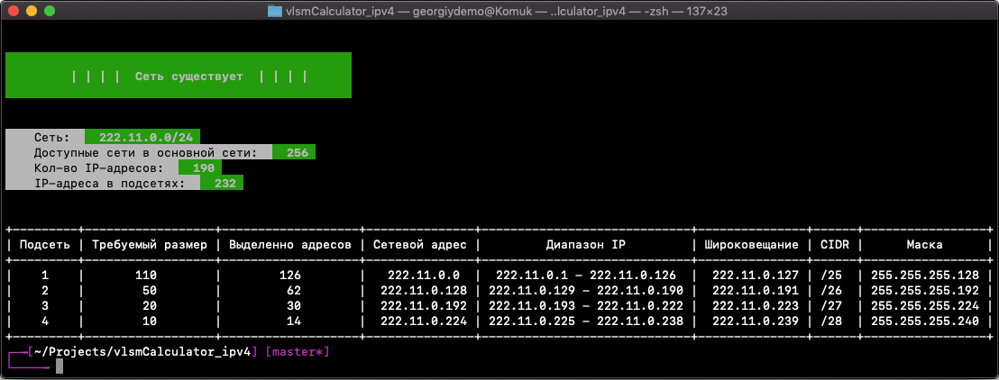
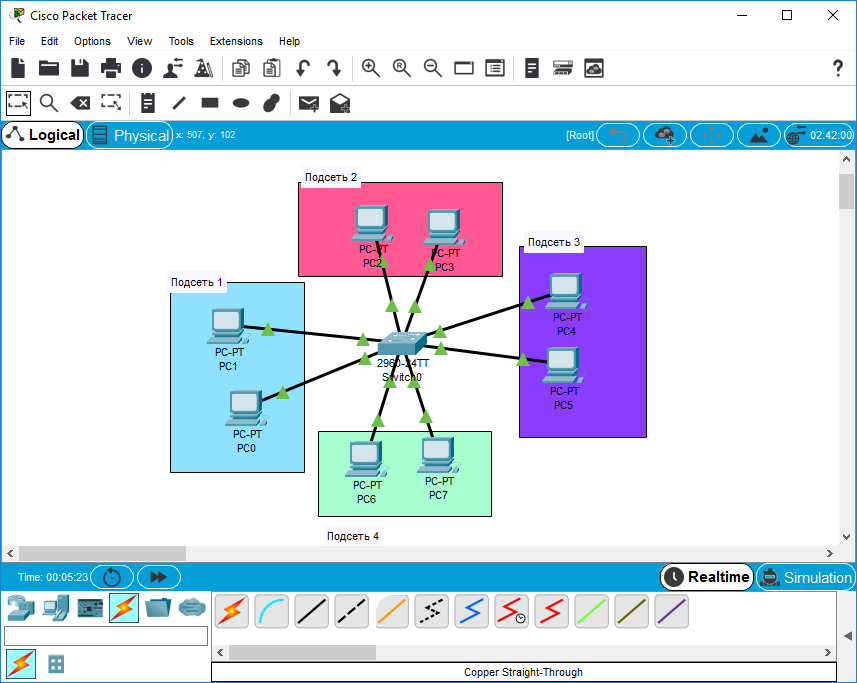
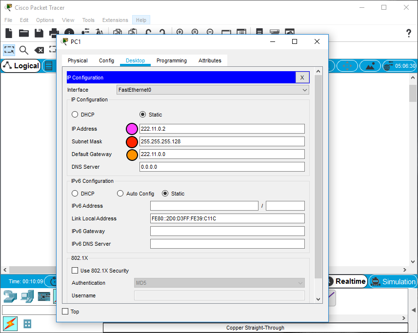
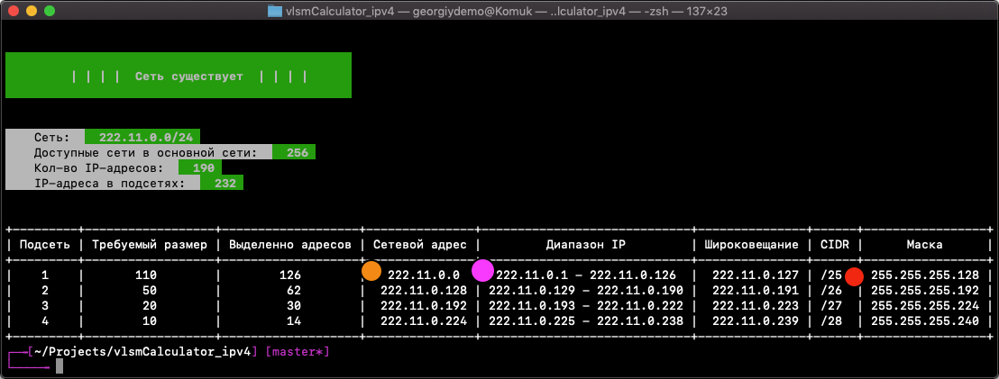
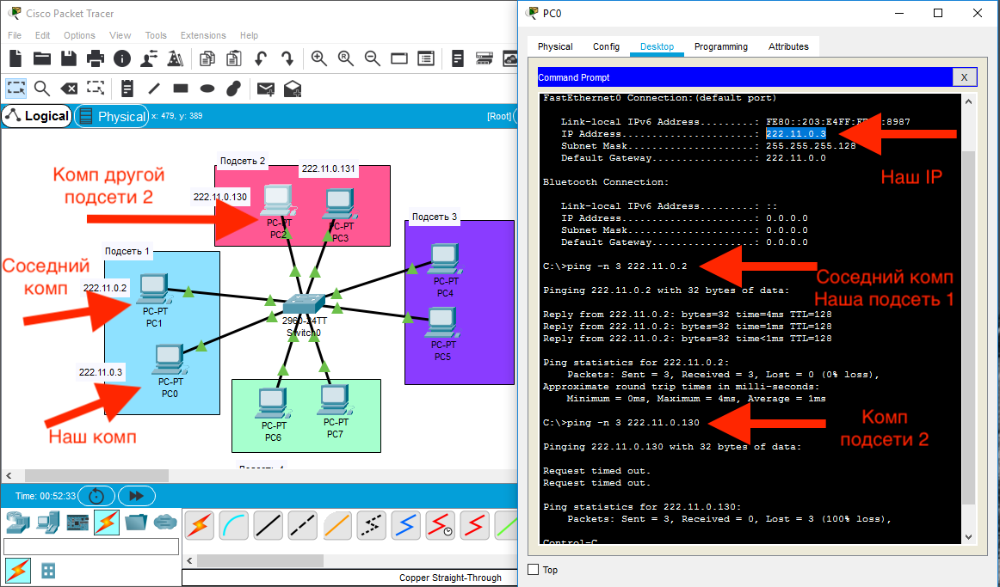

# Калькулятор подсетей VLSM
Нужен для экзамена по ОВС. Стырен у [@noecl1](https://github.com/noecl1) и переведен на Русский язык

## Подготовка к использованию

**1. Скачать репо**
```console
git clone https://github.com/GeorgiyDemo/FA
```
Или зеленая кнопка сверху в главном меню "Clone or download" -> Download ZIP<br>
и перейти в **/Course I/ОВС/экзамен/**

**2. Установить зависимости**
```console
pip3 install -r requirements.txt
```
или
```console
pip3 install netaddr
pip3 install prettytable
pip3 install colorama
```

**3. Запустить прогу**
```console
python3 vlsm.py
```


## Пример использования

**Задание: Разделить IP-сеть на подсети в соответствии с номером задания. Для каждой подсети указать широковещательный адрес. 222.11.0.0/24 4 подсети с 110, 20, 10 и 50 узлами**

1. Вводим сеть + маску: 222.11.0.0/24
2. Вводим кол-во подсетей: 4
3. Вводим кол-во узлов для каждой подсети: 110, 20, 10, 50




# Как работать с Cisco (ПАНК-метод без DHCP и со свичом)

### 1. Делаем свич и вокруг него набрасываем компутеров. Кол-во компутеров, для демонстрации, вычисляем так
```
Кол-во компутеров вокруг свича =  кол-во подсетей * 2
Т.е. в нашем случае:
8 = 4 * 2
```


### 2. Выделяем компы в группы (можно мысленно, можно визуально) и соединяем их со свичом



### 3. Для каждого компа переходим в Desktop -> IP configuration и заполняем данные статического IP.
Например, для **компутера 1** из **подсети 1** настройки будут такие:
```
IP Address - 222.11.0.2
Subnet Mask - 255.255.255.128
Default Gateway - 222.11.0.0
```
Для **компутера 2** из **подсети 1**:
```
IP Address - 222.11.0.3
Subnet Mask - 255.255.255.128
Default Gateway - 222.11.0.0
```

#### Откуда берутся эти данные?
Смотри цветные маркеры на изображениях ниже



Если ты это понял, то логично, что для **компутера 1** из **подсети 2** данные будут такие:
```
IP Address - 222.11.0.130
Subnet Mask - 255.255.255.192
Default Gateway - 222.11.0.128
```
и т.д.

### 4. Пингуем компы для проверки правильности разделения
Компы в одной сети должны видеть друг друга<br>
Компы в разных подсетях **НЕ** должны видеть друг друга

Для пинга переходим в Desktop -> Command Prompt и пишем:
```console
ping IP_компа
```
По картинке ниже все будет ясно
