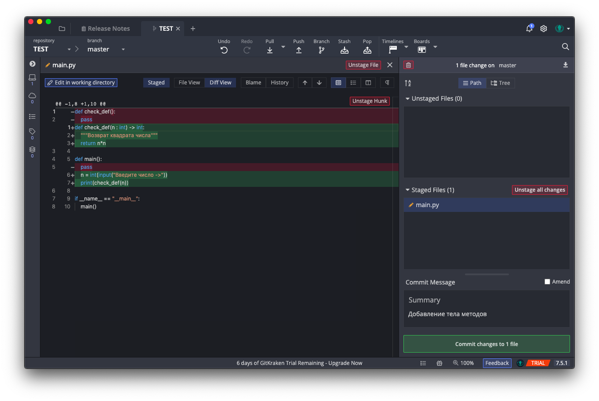
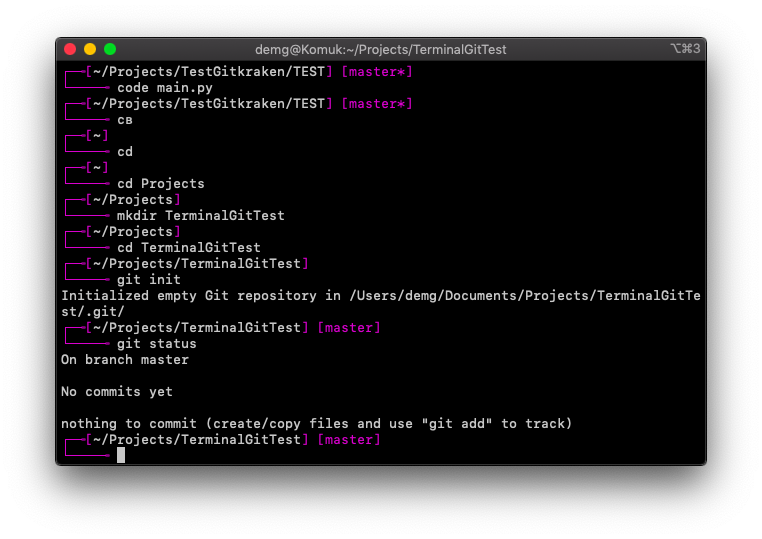

## 1. Основы работы с СКВ в графическом режиме

1.  Установить на компьютер графический клиент Git.

## 

2.  Создайте в своей домашней папке (или в любой другой на ваш выбор)
    > каталог, который будет содержать файлы нового программного
    > проекта.

3.  Выберите тематику программы, которую собираетесь написать. Язык
    > программирования и используемые инструменты разработки сейчас не
    > важны.

4.  Инициализируйте в этой директории репозиторий гит.

5.  Обратите внимание на появление в этой папке скрытой подпапки с
    > названием .git. Если вы ее не видите, то скорее всего, у вас
    > отключено отображение скрытых папок

6.  Создайте новый файл для исходного текста программы. Если вы
    > используете программный фреймворк, инициализируйте его в рабочий
    > каталог.

7.  Напишите несколько строк вашей программы.

8.  Добавьте файл с исходным текстом (несколько файлов, если необходимо)
    > в индекс вашего репозитория.

9.  Совершите ваш первый коммит. Напишите осмысленное сообщение коммита.

10. Повторите несколько раз. Каждый раз, завершая определенный этап
    > работы, выполняйте коммит и описывайте проделанные изменения в
    > сообщении коммита.

11. Просмотрите историю коммитов. Попробуйте перейти на один из прошлых
    > коммитов. Вернитесь в актуальное состояние программы.

## 2. Работа с Git в терминале

### Цель работы

На основе уже полученных знаний о принципах работы СКВ получить более
глубокое представление о работе Git при помощи команд терминала.

### Задания для выполнения

1.  Выберите тематику программы, которую собираетесь написать. Создайте
    > для нее рабочую директорию

> 

2.  Инициализируйте в рабочей директории репозиторий при помощи команды
    > git init.

> 

3.  Выполните в репозитории команду git status. Проинтерпретируйте
    > полученное сообщение.

> 

4.  Создайте файл для исходного текста программы. Выполните команду git
    > status.

> 

5.  Добавьте созданный файл под версионный контроль при помощи команды
    > git add. Еще раз выполните git status.

> 

6.  Сделайте начальный коммит при помощи команды git commit с опцией -m.

> 

7.  Сделайте еще несколько коммитов. Выполните команду git log для
    > просмотра истории коммитов.

> 

8.  Сделайте так, чтобы при коммите измененные файлы автоматически
    > добавлялись в коммит.

> 

9.  Добавьте еще несколько файлов с исходным текстом программы.

> 

10. Добавьте все новые файлы под версионный контроль одной командой.

> 

11. На всех стадиях работы пользуйтесь командой git status.

12. Инициализируйте в рабочей директории виртуальное окружение (Если вы
    > пишите не на Python, то можете инициализировать какой-либо
    > программный фреймворк, либо начать работать в IDE, которая создает
    > скрытую папку с настройками в рабочем каталоге).

> 

13. Добавьте созданную служебную папку в файл .gitignore. Проверьте, что
    > они не добавляются в репозитории при добавлении новых файлов с
    > исходным кодом.

> 

14. Создайте новую тематическую ветку git branch. Перейдите в нее с
    > помощью git checkout. Выведите на экран список всех веток.

> 

15. Сделайте несколько коммитов в основную и тематическую ветки.

> 

16. Слейте изменения в основную ветку с помощью git merge. Если
    > произошел конфликт слияния, разрешите его и завершите слияние с
    > помощью git commit.

> 
>
> 
>
> 

17. При получении в процессе разработки программы в стабильно работающем
    > состоянии, слейте это состояние в основную ветку и добавьте к
    > коммиту слияния пометку с номером релиза.

> 

## 3. Работа с удаленными репозиториями и GitHub
❗❗ Репозиторий, с которым работал - [demka-archive/RepoExample](https://github.com/demka-archive/RepoExample). 
Он создавался отдельным т.к. на тот момент Github Classroom еще не был орагнизован

### Цель работы

Освоить основные навыки работы с облачными и распределенными системами
контроля версий, получить навыки работы с инструментальными средствами,
обеспечивающими командную работу над разработкой ПО.

### Задания для выполнения

1.  Зарегистрироваться на сайте github.com и создать новый пустой
    > репозиторий

> 

2.  Создать в этом репозитории файл Readme

> 

3.  Установить на компьютере программу Git

4.  Склонировать созданный удаленный репозиторий в директорию
    > \~/git/test

> 

5.  На локальной машине пишем скрипт \~/git/test/backup.sh, с
    > произвольным содержанием

> 

6.  Фиксируем скрипт в репозитории (делаем коммит)

> 

7.  Обновляем удаленный репозиторий репозиторий (делаем пуш)

> 

8.  Через текстовый редактор добавить любую новую строку с комментарием

9.  Сделать коммит

10. Внести синтаксическую ошибку в скрипт

11. Сделать коммит ошибочного скрипта

> 

12. Откатываем до последней рабочей версии

> 
>
> 

13. Просмотреть историю коммитов

